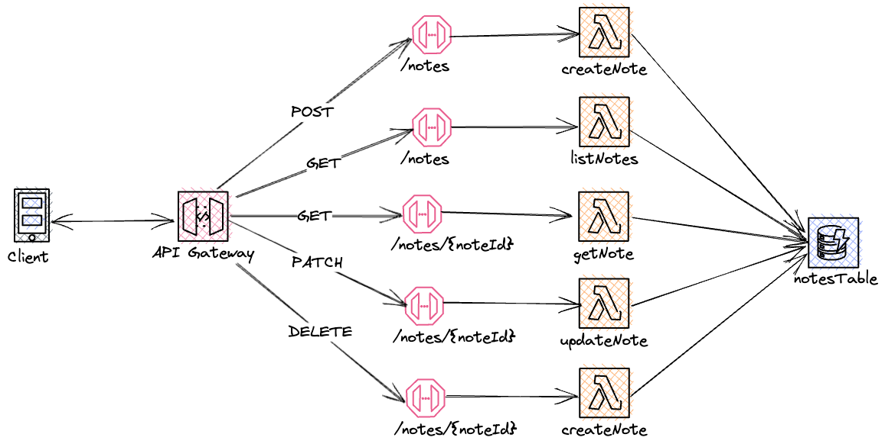

# Notes REST API

This is a Notes App REST API built using AWS SAM (Serverless Application Model).

## Overview and Architecture

The Notes App REST API utilizes AWS Lambda, API Gateway, and DynamoDB. It allows users to manage their notes through RESTful endpoints.



## Prerequisites

- AWS account with appropriate permissions
- AWS CLI installed and configured
- Node.js and npm installed

## Installation and Deployment

1. Clone the repository:

    ```bash
    git clone <repository-url>
    cd notes-rest-no-auth-js
    ```

2. Install dependencies
   ```bash
   npm install
   ```
3. Build and package the AWS SAM application
   ```bash
    sam build
    sam package --output-template-file packaged.yaml --s3-bucket <bucket-name>
   ```
4. Deploy the SAM application
   ```
    sam deploy --capabilities CAPABILITY_IAM
   ```
5. Once the deployment is complete, take note of the API Gateway endpoint URLs

<br>

# API Documentation
## Endpoints
- `GET /notes`: Get all notes
- `GET /notes/{notesId}`: Get a specific note by ID
- `POST /notes`: Create a new note
- `PATCH /notes/{notesId}`: Update an existing note
- `DELETE /notes/{notesId}`: Delete a note


## Example Requests and Responses

Create a note
```bash
  curl --location '<api-gateway-url>/notes?userId=abc123' \
--header 'Content-Type: application/json' \
--data '{
  "title": "Grocery list",
  "content": "Buy Milk, bread, butter, cheese, Tea and Coffee",
  "label":"Home"
}'
``` 

Response
```json
  {
    "userId": "abc123",
    "noteId": "7fd5cb77-8c96-495a-bb23-19931a82704d",
    "title": "Grocery list",
    "content": "Buy Milk, bread, butter, cheese, Tea and Coffee",
    "label": "Home",
    "createdAt": "2023-05-09T12:46:37.472Z",
    "updatedAt": "2023-05-09T12:46:37.472Z"
}
```

Get a note
```bash
  curl --location '<api-gateway-url>/notes/7fd5cb77-8c96-495a-bb23-19931a82704d?userId=abc123'

```

Response
```json
  {
    "content": "Buy Milk, bread, butter, cheese, Tea and Coffee",
    "noteId": "7fd5cb77-8c96-495a-bb23-19931a82704d",
    "userId": "abc123",
    "updatedAt": "2023-05-09T12:46:37.472Z",
    "label": "Home",
    "createdAt": "2023-05-09T12:46:37.472Z",
    "title": "Grocery list"
}
```